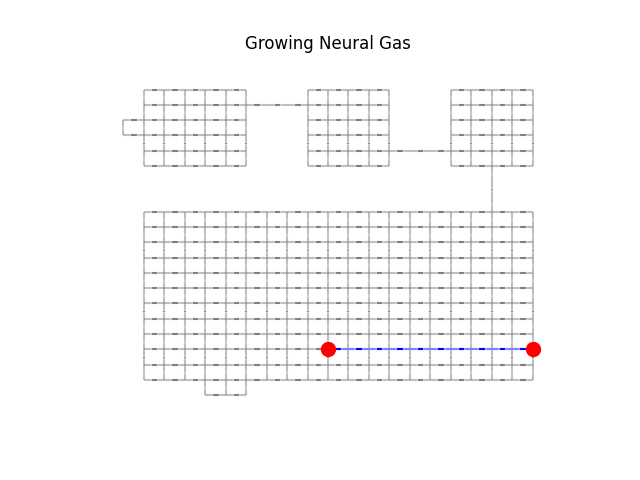
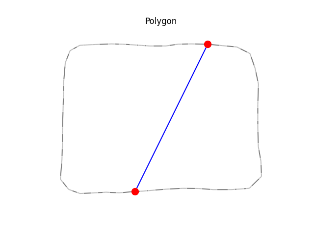
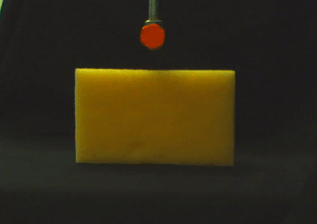
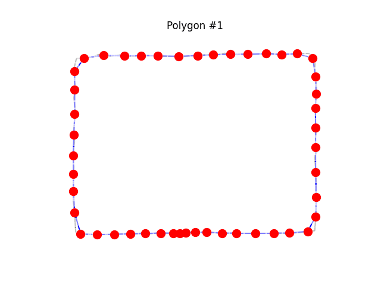

GNG - Growing Neural Gas
===

Implementation of Growing Geural Gas Networks.

In this repo I show two exaples of how GNG is used, and then I use it to analyze the countour of an object in a video to get a constant number of points describing the contour over time.

In this repo I tried to replicate part of the paper from Ana-Maria Cretu __"Deformable Object Segmentation and Contour Tracking in Image Sequences Using Unsupervised Networks"__

Usage:
---

1. Install dependencies:

   ```
   pip install -r requirements.txt
   ```
# Example 1

1. Execute:

   ```
   python example_1.py
   ```

2. You will see output after 10000 iterations in `output/example_1/`.

   


# Example 2

1. Execute:

   ```
   python example_2.py
   ```

2. You will see output after 10000 iterations in `output/example_2/`.

   


# Using GNGN to Analyze Contour Sequences
The Growing Neural Gas can also be used to analize the contour of a sequence, producing a graph with a constant number of points over time. For example we use it to analyze the following video of a dish-washing sponge pushed by a robotic finger:

   

Using opencv in another program we get the points of the contour which is a variable number of points over time, and this is going to be the input for the GNGN.

1. Execute:

   ```
   python analyze_sequence.py
   ```

2. You will see output after 10000 iterations as `output/sponge_center_[id]/sequence.gif`.

   

   The GNGN is first adapted on the frame #27 and then this graph is going to be the input for the previous and next GNGNs that will be trained for the other frames, this way we assure there is the same number of points in all frames.
   The sequences used as input can be found in `/video_sequences`

3. As a result you will also get a numpy file containing the coordinates of the polygons over time in `output/sequence_[id]/sequence.npy`


To reformat the code automatically:

   ```
   black .
   ```